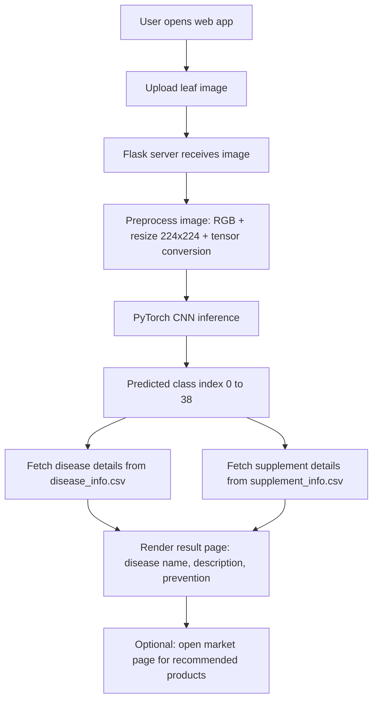

# LEAF HEALTH DETECTOR
## Interim Presentation 2

**Presentation Dates:** 16/03/2026, 23/03/2026, 24/03/2026  
**Project Type:** Deep Learning + Web Application for Plant Disease Detection

---

## 1. Process Flow Diagram (Workflow / Architecture)

### Modules in Current Implementation
- `app.py`: Flask routes, model loading, image upload handling, inference, and result rendering.
- `CNN.py`: CNN architecture definition and class index mapping (`39` output classes).
- `disease_info.csv`: Disease name, description, preventive steps, and reference image URL.
- `supplement_info.csv`: Supplement/product mapping and buy links.
- `templates/*.html`: UI pages (`home`, `index`, `submit`, `market`, `contact`).

---

## 2. Dataset / Database Description

### Data Sources Used in the Project
- **Primary prediction classes:** 39 total classes (plant diseases + healthy classes).
- **Disease metadata file:** `disease_info.csv`.
- **Supplement recommendation file:** `supplement_info.csv`.

### Record Counts
- `disease_info.csv`: **39 rows**.
- `supplement_info.csv`: **39 rows**.

### `disease_info.csv` Fields
- `index`: Class ID used by model output.
- `disease_name`: Human-readable disease name.
- `description`: Disease explanation and symptoms.
- `Possible Steps`: Recommended prevention/management actions.
- `image_url`: Reference image URL.

### `supplement_info.csv` Fields
- `index`: Class ID.
- `disease_name`: Class label text.
- `supplement name`: Recommended product.
- `supplement image`: Product image URL.
- `buy link`: Purchase/reference link.

### Data Usage Logic
- The model predicts an index (`0..38`).
- The same index retrieves disease details and supplement details from both CSV files.
- This ensures consistent mapping between AI output and user recommendation content.

---

## 3. Proposed Method (Algorithm) / Module Description

### Proposed Algorithm
**Convolutional Neural Network (CNN) based image classification** using PyTorch.

### Core Pipeline
1. User uploads a leaf image through `/submit`.
2. Image is converted to RGB and resized to `224 x 224`.
3. Image is converted to tensor and passed to trained CNN (`plant_disease_model_1_latest.pt`).
4. Model outputs logits for 39 classes.
5. `argmax` selects the predicted class index.
6. Flask fetches disease and supplement details using the predicted index.
7. Result page is rendered with disease name, description, prevention steps, and product suggestion.

### CNN Module (`CNN.py`)
- 4 convolution blocks, each following:
- `Conv2d -> ReLU -> BatchNorm -> Conv2d -> ReLU -> BatchNorm -> MaxPool`
- Channel progression: `3 -> 32 -> 64 -> 128 -> 256`.
- Flatten size: `50176`.
- Dense head: `Linear(50176, 1024) -> ReLU -> Dropout(0.4) -> Linear(1024, 39)`.

### System Modules
- **UI Module:** Templates + static files for user interaction.
- **Inference Module:** Image preprocessing and prediction function (`prediction`).
- **Knowledge Module:** CSV-driven disease and supplement information.
- **Service Module:** Flask routes (`/`, `/index`, `/submit`, `/market`, `/contact`).

---

## 4. Results and Screenshots

### Current Result Status
- End-to-end prediction flow is integrated and running through Flask.
- Disease detail and prevention content are successfully shown after prediction.
- Supplement recommendation and market listing are linked by class index.

### Sample Screenshots (from project)

#### Home / Landing Page

#### Image Upload / Prediction Page

#### Prediction Result Page

#### Market / Supplement Page

### Observed Output Behavior
- Model returns one of 39 classes for each uploaded leaf image.
- Result page provides predicted disease title, description, preventive/remedial steps, and suggested supplement buy link.

---

## 5. Conclusion and Future Enhancement

### Conclusion
The Leaf Health Detector project demonstrates a practical AI-based approach for plant disease identification using leaf images. The current system successfully combines:
- CNN-based disease classification,
- web deployment via Flask,
- and recommendation support via CSV knowledge bases.

This provides a usable prototype for early disease awareness and basic decision support for farmers and gardeners.

### Future Enhancements
1. Improve model robustness with more real-field images (lighting, background, blur variations).
2. Add confidence score display and top-3 predictions for better interpretability.
3. Integrate multilingual UI for wider accessibility.
4. Add feedback loop so users can report wrong predictions and improve retraining data.
5. Move metadata from CSV to a structured database (SQLite/PostgreSQL) for scalability.
6. Add mobile camera capture optimization and lightweight on-device inference option.
7. Include severity estimation (early/mid/late infection stage) in addition to class label.

---

## Quick Demo Note for Presentation
- Start from `home` -> open `index` -> upload sample leaf image -> show `submit` result -> open `market` recommendations.
- Mention that model weights are auto-downloaded in `app.py` if not present locally.
