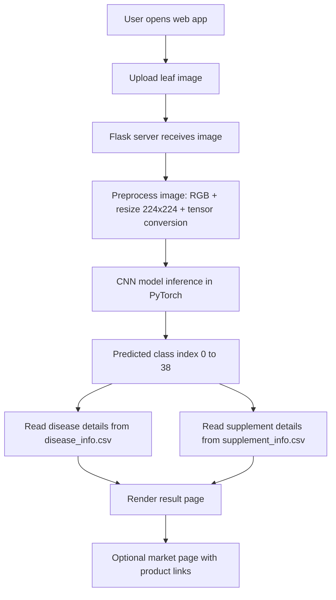

# Leaf Health Detector
## Combined Interim Presentation (Interim 1 + Interim 2)

**Interim 1 Dates:** 26/02/2026, 27/02/2026  
**Interim 2 Dates:** 16/03/2026, 23/03/2026, 24/03/2026

---

## Slide 1: Title Slide
- **Project Title:** Leaf Health Detector
- **Subtitle:** AI-Based Plant Disease Classification and Recommendation System
- **Presentation:** Combined Interim 1 and Interim 2
- **Dates:** 26/02/2026, 27/02/2026, 16/03/2026, 23/03/2026, 24/03/2026
- **Presented by:** [Team Member Names]
- **Guide:** [Guide Name]

---

## Slide 2: Introduction
- Plant diseases reduce crop quality and yield, causing major economic losses.
- Manual diagnosis is slow, location-dependent, and requires expertise.
- Farmers need an accessible, quick, and reliable disease screening tool.
- This project provides an AI-powered web application for leaf disease detection.

---

## Slide 3: Literature Survey
- **Traditional image processing methods:**
  - Use color and texture features with handcrafted rules.
  - Sensitive to lighting, background clutter, and camera quality.
- **Classical machine learning approaches:**
  - SVM/Random Forest on extracted features.
  - Better than manual rules but dependent on feature engineering.
- **Deep learning approaches (CNN/Transfer Learning):**
  - Learn features automatically from images.
  - Provide strong accuracy and better generalization for visual classification.
- **Deployment trend:**
  - Research is moving from offline experiments to real-time web/mobile support tools.

---

## Slide 4: Drawbacks of Existing System
- Manual diagnosis requires expert availability.
- Delayed diagnosis can increase spread and crop damage.
- Traditional rule-based systems are less robust under field variability.
- Many research prototypes are not user friendly or not deployment ready.
- Existing tools often do not integrate disease explanation and treatment recommendation together.

---

## Slide 5: Proposed System
- A Flask web application that predicts plant leaf disease from uploaded images.
- Uses a PyTorch CNN model for 39-class classification.
- Connects predicted class to:
  - disease description and prevention (from `disease_info.csv`)
  - supplement recommendation and buy links (from `supplement_info.csv`)
- Provides end-to-end flow: image upload -> prediction -> actionable output.

---

## Slide 6: Process Flow Diagram (Workflow)

---

## Slide 7: System Architecture / Module Description
- **Frontend Module:**
  - Templates: `home.html`, `index.html`, `submit.html`, `market.html`, `contact-us.html`
- **Backend Module:**
  - `app.py` handles routes, image upload, inference, and result rendering
- **AI Module:**
  - `CNN.py` contains CNN architecture and class mapping
- **Knowledge Module:**
  - CSV-based disease and supplement information retrieval
- **Deployment Module:**
  - `Procfile`, `render.yaml`, and model auto-download support

---

## Slide 8: Initial Model Design
- **Model Type:** Convolutional Neural Network (CNN)
- **Input:** RGB leaf image resized to 224 x 224
- **Convolution blocks:**
  - 4 blocks: Conv2D + ReLU + BatchNorm + Conv2D + ReLU + BatchNorm + MaxPool
  - Channel progression: 3 -> 32 -> 64 -> 128 -> 256
- **Dense head:**
  - Flatten (50176)
  - Linear(50176, 1024) + ReLU + Dropout(0.4)
  - Linear(1024, 39)
- **Output:** 39 classes (diseased and healthy categories)

---

## Slide 9: Proposed Method (Algorithm)
1. Receive image from user.
2. Convert image to RGB.
3. Resize image to 224 x 224.
4. Convert to tensor and add batch dimension.
5. Run forward pass through trained CNN (`plant_disease_model_1_latest.pt`).
6. Apply argmax to obtain predicted class index.
7. Fetch corresponding disease/supplement metadata from CSV files.
8. Render prediction result with disease name, description, prevention steps, and product suggestion.

---

## Slide 10: Language and Technology
- **Programming Language:** Python
- **Deep Learning Framework:** PyTorch, Torchvision
- **Web Framework:** Flask
- **Data Handling:** Pandas, NumPy
- **Image Processing:** Pillow
- **Model Delivery:** gdown (Google Drive model download)
- **Deployment Related:** Gunicorn, Render (`render.yaml`)
- **Frontend Stack:** HTML, CSS, JavaScript

---

## Slide 11: Datasets / Database Description
- **Classification scope:** 39 classes (leaf diseases + healthy classes)
- **Metadata files used as project database:**
  - `disease_info.csv`
  - `supplement_info.csv`
- **`disease_info.csv` fields:**
  - `index`, `disease_name`, `description`, `Possible Steps`, `image_url`
- **`supplement_info.csv` fields:**
  - `index`, `disease_name`, `supplement name`, `supplement image`, `buy link`
- **Mapping rule:**
  - Predicted class index maps directly to both CSV records for unified output.

---

## Slide 12: Result and Screenshot
- End-to-end pipeline is implemented and functional.
- Working flow:
  - Upload image -> predict disease -> show disease details -> show prevention steps -> suggest supplement.
- Insert screenshots from project folder:
  - `demo_images/Screenshot 2025-07-03 013624.png` (Home)
  - `demo_images/Screenshot 2025-07-03 013854.png` (Upload/Predict)
  - `demo_images/Screenshot 2025-07-03 014910.png` (Result)
  - `demo_images/Screenshot 2025-07-03 015050.png` (Market)

---

## Slide 13: Conclusion
- The project successfully combines AI-based disease detection with a practical web interface.
- CNN-based 39-class classification is integrated with explanatory disease and supplement information.
- The prototype demonstrates feasibility for quick preliminary decision support in agriculture.

---

## Slide 14: Future Enhancement
- Add confidence score and top-3 predictions.
- Improve model robustness with more real-field images.
- Add multilingual UI support.
- Introduce user feedback loop for wrong predictions and retraining.
- Replace CSV knowledge base with scalable database (SQLite/PostgreSQL).
- Extend to severity-stage prediction (early/mid/late infection).

---

## Slide 15: Demo Flow and Q&A
- Demo sequence:
  1. Open Home page
  2. Navigate to prediction page
  3. Upload sample leaf image
  4. Show disease result and prevention
  5. Show market recommendations
- Thank You
- Questions

---

## Submission Note (as per announcement)
- Submit hard copy documents to the concerned guide.
