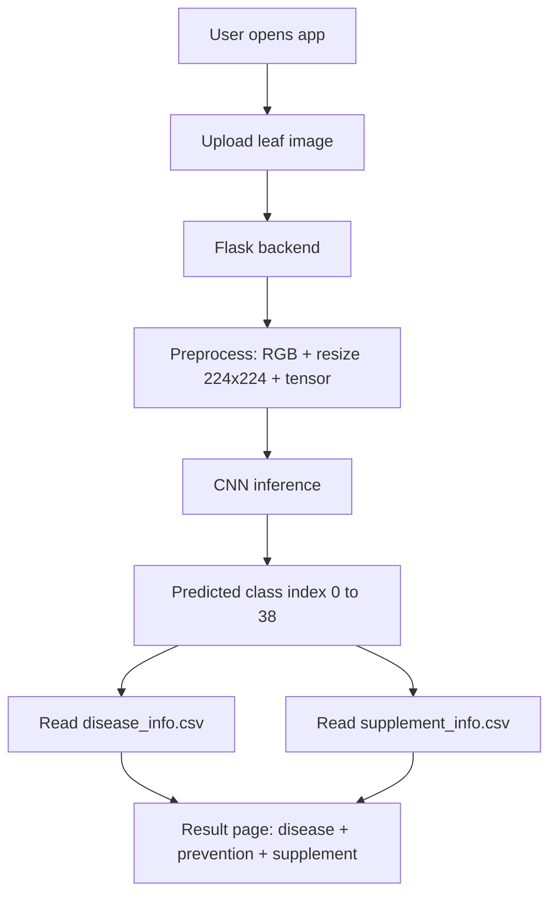

# Leaf Health Detector
## Compact Combined Interim Presentation (10 Slides)

## Slide 1: Title
- Leaf Health Detector
- Combined Interim Presentation (Interim 1 + Interim 2)
- Dates: 26/02/2026, 27/02/2026, 16/03/2026, 23/03/2026, 24/03/2026
- Presented by: [Team Names]
- Guide: [Guide Name]

## Slide 2: Introduction + Problem Statement
- Plant diseases cause major crop loss and quality reduction.
- Manual diagnosis needs experts and is time-consuming.
- Need a fast, accessible, and low-cost preliminary diagnosis system.
- Objective: AI web app to detect leaf diseases and suggest management.

## Slide 3: Literature Survey + Existing Drawbacks
- Traditional image processing depends on handcrafted features and controlled conditions.
- Classical ML models rely heavily on manual feature engineering.
- Deep learning (CNN) provides better automatic feature extraction and accuracy.
- Existing systems often have these gaps:
  - Not robust in real field conditions
  - Limited usability for non-technical users
  - No integrated disease explanation + treatment recommendation

## Slide 4: Proposed System
- Web-based disease detection using uploaded leaf images.
- CNN model classifies image into one of 39 classes.
- Predicted index maps to:
  - disease details and preventive steps
  - supplement recommendation and link
- Delivers end-to-end user flow from upload to actionable result.

## Slide 5: Workflow / Process Flow Diagram

## Slide 6: Initial Model Design + Algorithm
- Model: Convolutional Neural Network (PyTorch)
- Input: 224 x 224 RGB leaf image
- Architecture summary:
  - 4 Conv blocks (Conv + ReLU + BatchNorm + MaxPool)
  - Dense layers: 50176 -> 1024 -> 39, with Dropout(0.4)
- Algorithm flow:
  - preprocess image -> CNN forward pass -> argmax class -> fetch mapped details -> display output

## Slide 7: Language / Technology + Module Description
- Language: Python
- Frameworks/Libraries: Flask, PyTorch, Torchvision, Pandas, NumPy, Pillow, gdown, Gunicorn
- Modules:
  - Frontend: HTML templates and static assets
  - Backend: routes, upload handling, prediction logic
  - AI: CNN model and weights
  - Data layer: disease and supplement CSV mapping

## Slide 8: Dataset / Database Description
- Classification classes: 39
- Data sources:
  - disease_info.csv
  - supplement_info.csv
- disease_info.csv fields: index, disease_name, description, Possible Steps, image_url
- supplement_info.csv fields: index, disease_name, supplement name, supplement image, buy link
- Same class index key ensures consistent recommendation mapping.

## Slide 9: Results and Screenshots
- Functional status: Complete end-to-end prediction pipeline working.
- Output after upload:
  - Predicted disease class
  - Disease description
  - Prevention/remedial guidance
  - Supplement recommendation and link
- Add screenshots:
  - Home page
  - Upload/prediction page
  - Result page
  - Market/recommendation page

## Slide 10: Conclusion + Future Enhancement
- Conclusion:
  - Project successfully integrates deep learning and web deployment for plant health support.
  - Practical prototype for quick preliminary disease identification.
- Future enhancements:
  - confidence score + top-3 predictions
  - more real-field training data
  - multilingual UI
  - user feedback loop for retraining
  - migrate CSV to SQLite/PostgreSQL
  - disease severity stage prediction

---

## Presentation Timing Tip (for strict schedule)
- Slide 1: 20 sec
- Slides 2-4: 2 min
- Slides 5-8: 3.5 min
- Slide 9: 1.5 min
- Slide 10: 1 min
- Total: about 8 to 9 minutes
